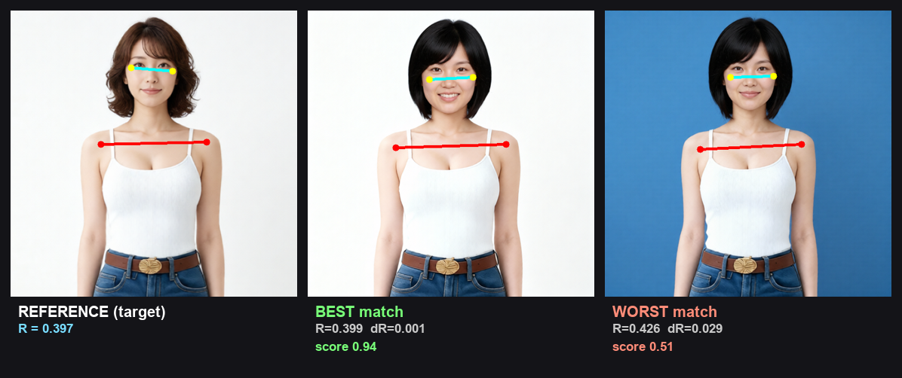
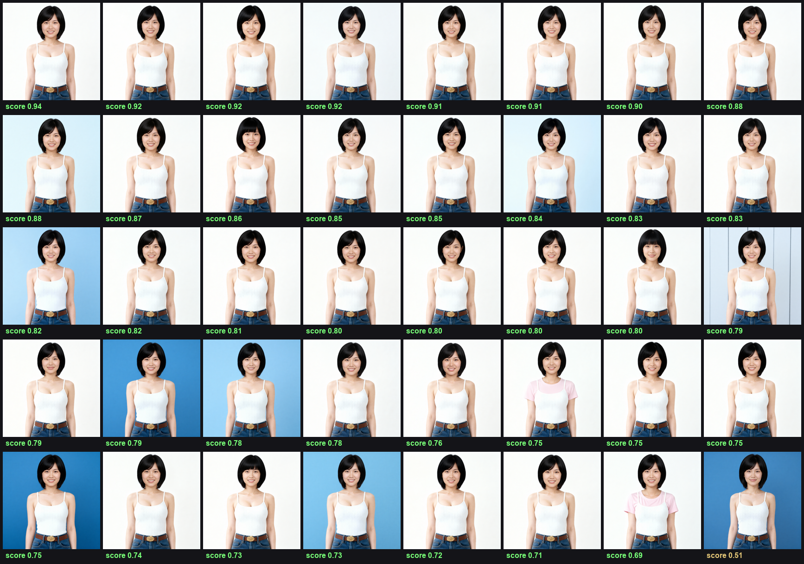
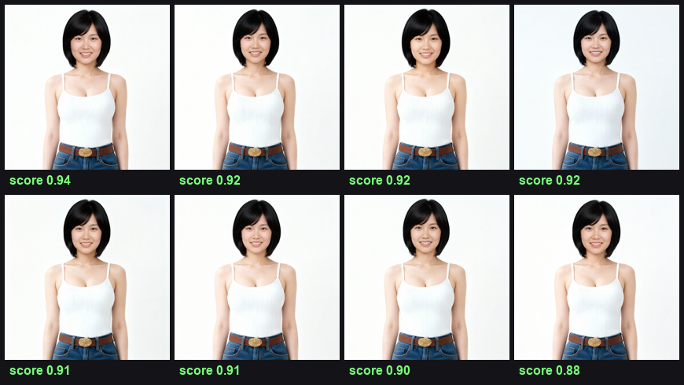
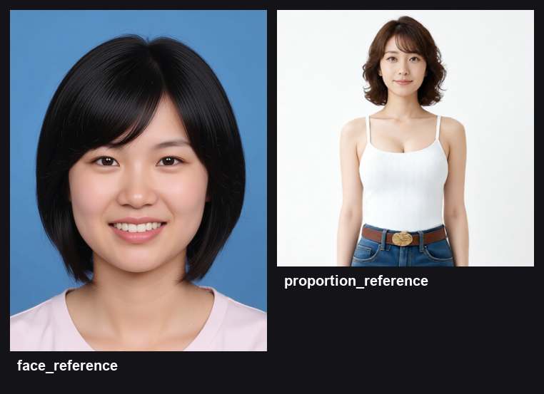

# ComfyUI-QualityGate

**「顔写真 → 人物生成」で毎回ブレる頭サイズ比（頭幅/肩幅）と顔の一致を、参照(お手本)に近い順へ自動ランキングする ComfyUI カスタムノード。**
バッチ生成した候補を受け取り、**顔類似 × 頭サイズ比 × 鮮鋭度**を合成スコア化 → 近い順に並べ替え → **合格分だけを納品**する。

InstantID / PhotoMaker / IP-Adapter / PuLID などで人物を生成すると、顔は似ていても頭サイズ比が崩れたり、逆に比率は良いが顔が別人化したりする。従来は **数十枚生成して手作業で外れを捨てる**のが標準手順。そこを定量化して自動化する。

> なぜこれを作れるのが差別化になるのか: ComfyUI のフリーランサーの大半は「ノードを配線できるアーティスト」で、
> pose 幾何 / CV を書ける人はほぼいない。**頭サイズ比の"計測"ノードは既存の配布ノードに存在しない空白（whitespace）**で、
> 検出→スコア化→自動選別のカスケード設計（[SeedCount](#設計の背景) の種検出プロジェクトからの転用）が武器になる。

---

## 何を測って選んでいるか



参照(お手本)の頭サイズ比 `R = 耳幅 / 肩幅` を基準に、バッチ各画像の R を計測してズレを採点する（上図の左が"比率"のお手本 = proportion_reference）。
上図の **BEST**（ΔR=0.001, score 0.94）と **WORST**（ΔR=0.029, score 0.51）のように、
node は比率差と顔類似を定量化して順位化する。R は頭幅/肩幅の比なので**上半身クロップでも全身でも測れる**（本デモは上半身）。**「綺麗さ」ではなく「参照からの逸脱」を数値で選ぶ**のが核。

## Before / After（実バッチ 40枚 → 上位8枚）

同一人物・別 seed で生成した40枚（背景もバラバラ）を `CompositeRank`（顔類似 × 頭サイズ比 × 鮮鋭度）で全採点し、参照に近い順へ並べた。**背景の違いに釣られず**、顔と比率で連続スコアの順位が付く。

| Before：生成そのまま（40枚・score降順） | After：上位8枚（自動選別・納品分） |
|---|---|
|  |  |

参照（左: face_reference / 右: proportion_reference）。顔のお手本と比率のお手本は別々に指定でき、別人でもよい:



## 指標の設計 — 「美しさ」ではなく「計測」

頭サイズ比の"良し悪し=美"は定義不能な地雷なので**主張しない**。代わりに **参照画像からの逸脱を数値化**して近い順に並べる。

計測指標（実データで検証・確定）:

```
R = 耳〜耳の距離(頭幅) / 肩幅        ※微小クロップ K 回の平均 (TTA) で算出
```

| 設計判断 | 根拠（実測） |
|---|---|
| 頭幅に **耳〜耳 (Pose 7,8)** を採用 | 髪が下に伸びても不変＝**髪型に頑健**。髪で耳が隠れても Pose が位置推定し、可視/不可視で挙動が変わらない（分岐不要） |
| 肩幅 **(Pose 11,12)** を基準 | body スケールに正規化＝**クロップ・距離に不変** |
| **TTA (K枚クロップ平均)** で測定 | 単発はキーポイント揺れ **std≈0.006** が信号 **std≈0.012** の半分を占める（指標検証時の値）。K枚平均でノイズを 1/√K に低減し、**S/N ≈ 7**、**0.01 の比率差を識別可能** に |
| 採点は **指数減衰** `exp(-|ΔR|/tol)` | ハードクランプだと参照がバッチから離れた際に全画像0点で飽和し順位が付かない。指数減衰なら遠くても単調に下がり**常に近い順へランキング**できる |

旧案「髪込み頭面積 ÷ 胴体長²」は (1) 長い髪で過大 (2) 全身画像の小さい顔で顔検出が失敗、のため不採用。耳〜耳は顔検出もセグメントも顎ラインも要らず最も頑健。

## 精度・速度（実バッチ40枚での実測）

| 指標 | 値 |
|---|---|
| 頭サイズ比 R の計測分解能（TTA後 S/N） | **≈ 7**（ΔR ≈ 0.01 を識別） |
| 実バッチ40枚の R ばらつき | **0.389–0.426（std 0.0073）** ＝目視困難な微差を定量ランク |
| 顔類似スコアのばらつき | **0.52–0.95** ＝同一人物でも角度/崩れで分離 |
| 1枚あたり処理時間 | **≈ 0.5 s**（pose + ArcFace + 鮮鋭度、pose は CPU 実行） |
| 選別 | 40枚を全採点 → 上位 k 枚を自動抽出（目視選別を置換）。決定的＝同入力で順位再現 |

採点は多軸合成。合成スコアの内訳（同バッチの最上位/最下位）:

| | identity（顔類似） | proportion（頭サイズ比） | sharpness（鮮鋭度） | 合成 |
|---|---|---|---|---|
| 1位 (best) | 0.93 | 0.93 | 1.00 | **0.94** |
| 40位 (worst) | 0.64 | 0.24 | 0.81 | **0.51** |

> 最下位は3軸すべてが低い（顔がやや外れ・頭サイズ比が離れ・わずかにボケ）。最上位は全軸が高く、**複数の妥協点を1つの合成スコアで解いている**のが分かる。

---

## ノード

すべて `QualityGate` カテゴリに登録される。

### ★ Composite Rank — 顔類似 × 頭サイズ比 × 鮮鋭度で総合ランキング（②の本命）
参照顔とお手本の頭サイズ比に**総合で近い順**へバッチを並べ替える。顔類似と比率はしばしば相反する（顔を寄せると頭サイズ比が崩れる）ため、重み付き合成で最適な妥協点を選ぶ。

| 入力 | 内容 |
|---|---|
| `face_reference` | 保持したい本人の顔（正解の頭） |
| `proportion_reference` | 目標の頭サイズ比のお手本（正解の比率） |
| `images` | 並べ替え対象バッチ |
| `w_identity` / `w_proportion` / `w_sharpness` | 各軸の重み（0で無効化） |
| `tolerance` | 頭サイズ比採点の e-folding スケール（小さいほど近さに敏感, 既定 0.02） |

出力: `ranked_images`（近い順）/ `best_image`（1位）/ `report`（軸ごとの内訳スコア）

### ★ Composite Rank Folder — 大量候補向け・メモリ非依存
上と同じ採点式で、**フォルダを1枚ずつストリーミング採点**する。画像を全部メモリに載せず `[読込→採点→破棄]` するので、候補が何百枚でも RAM は `top_k` 枚ぶんしか使わない。**二段構成の第2段**（後述）。

`folder` は ComfyUI の `output/` 配下サブフォルダをドロップダウンで選択。出力: `top_images` / `best_image` / `report`。

### Proportion Match Rank — 頭サイズ比だけで並べ替え
顔参照が不要なケース向けの軽量版。`reference`（お手本1枚）+ `images` → 頭サイズ比が近い順。出力: `ranked_images` / `best_image` / `target_ratio` / `report`。

### Quality Gate / Quality Filter Batch — 汎用QA（顔の有無・ボケ）
参照が不要な一般的な破綻検出。`face_presence`(顔の欠落/想定外人数) と `sharpness`(ボケ) のカスケードで、`QualityFilterBatch` は**合格画像だけ**を通す。`QualityGate` は `all_passed` を出しリトライループの判定に使える。

---

## 二段構成（VRAM対策）

候補を多く出すと、サンプラーが全 latent を一括処理して VRAM OOM になる。そこで生成と選別を分離する:

1. **Stage 1（生成専用）**: `RepeatLatentBatch` を小さく保ち、`SaveToFolder` で候補をフォルダへ書き出す。Queue を複数回まわすと候補が積み上がる。
2. **Stage 2（選別）**: `CompositeRankFolder` が同じフォルダを1枚ずつ採点し、上位だけ納品。

サンプルは `example_workflows/qwen_FAST_generate_candidates.json`（Stage 1）/ `stage2_rank_folder.json`（Stage 2）。

---

## インストール

```bash
cd ComfyUI/custom_nodes
git clone https://github.com/nobu1990/ComfyUI-QualityGate
pip install -r ComfyUI-QualityGate/requirements.txt
```

| 機能 | 追加依存 | 無い場合の挙動 |
|---|---|---|
| 顔の有無 / 鮮鋭度（汎用QA） | opencv-python, numpy のみ | — |
| 頭サイズ比（Proportion / Composite） | `mediapipe`（Pose） | 該当軸を `skipped` にしてカスケードを壊さない |
| 顔類似（Composite の identity 軸） | `insightface` + `onnxruntime(-gpu)` + buffalo_l | `w_identity` を自動的に 0 扱い |

ComfyUI を再起動すると `QualityGate` カテゴリにノードが追加される。pose モデルは初回に `models/` へ自動DLされる。

## 使い方

`example_workflows/composite_rank_demo.json` を ComfyUI にドラッグ＆ドロップ。実運用では `VAEDecode` の IMAGE 出力を `CompositeRank` の `images` に繋ぎ、`best_image`（または `ranked_images` の上位）を `SaveImage` に送る。大量候補なら二段構成を使う。

## 開発 / テスト

ComfyUI や torch 無しで検出ロジックを検証できる（設計上、計測は純粋関数）:

```bash
python tests/test_body_proportion.py   # 頭サイズ比の計測・採点
python tests/test_identity.py          # 顔類似スコア
python tests/test_cascade.py           # 汎用QAカスケード
python tests/test_nodes.py             # ノード配線の統合テスト
```

## 設計の背景

「計測 → スコア化 → 閾値で自動選別/リロール」というカスケード構造は、種カウントプロジェクト（`seed_prelabel.py`: 彩度マスク → 距離変換ピーク → オーバーレイ可視化 → CSVサマリ）の発想をそのまま生成物選別へ転用したもの。領域が違っても「検出して弾く」骨格は同じで、チェックの中身を差し替えるだけで拡張できる。

**ロードマップ**:
- [ ] 複数物体プロンプトの指示追従検証（VLM 分解照合 / VQAScore 系。既存ノードに未パッケージの空白）
- [ ] リトライループのサンプルワークフロー

## License
MIT
